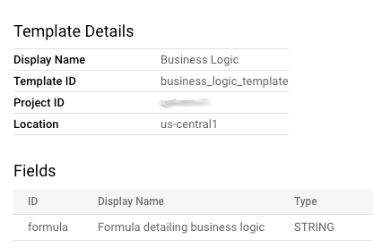
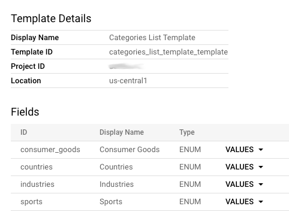
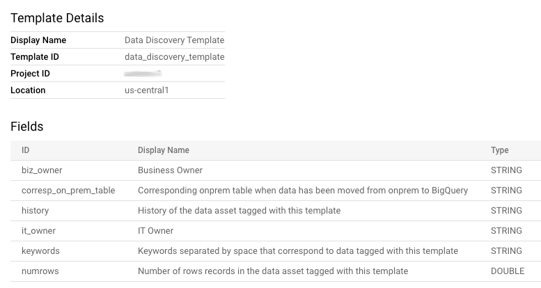
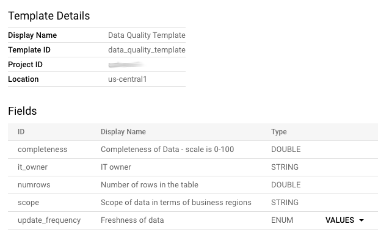
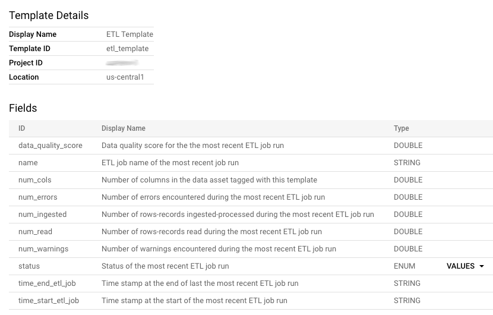

[Back to README.md](../README.md)

# Templates Examples

> ⚠️ Beware: This is a **community-maintained** informal knowledge base.
- **Contribute** with a PR if you have Data Catalog Templates examples to share.

In this doc we have list of curated Data Catalog Templates. You are able to create those Templates
in your project by using [`datacatalog-util` tag-templates create CLI][create templates] pointing to the sample CSV files.

## Business Logic Template
This Template represents Business Logic metadata:

Check the [CSV sample][business_logic_template].

## Categories List Template
This Template represents Categories metadata:

Check the [CSV sample][categories_list_template].

## Data Discovery Template
This Template represents Data Discovery metadata:

Check the [CSV sample][data_discovery_template].

## Data Quality Template
This Template represents Data Quality metadata:

Check the [CSV sample][data_quality_template].

## ETL Template
This Template represents ETL metadata:

Check the [CSV sample][etl_template].

## PII Template
This Template represents PII metadata:

Check the [CSV sample][pii_template].

[business_logic_template]: https://github.com/mesmacosta/datacatalog-util/tree/master/sample-input/create-tag-templates/business_logic_template.csv
[categories_list_template]: https://github.com/mesmacosta/datacatalog-util/tree/master/sample-input/create-tag-templates/categories_list_template.csv
[data_discovery_template]: https://github.com/mesmacosta/datacatalog-util/tree/master/sample-input/create-tag-templates/data_discovery_template.csv
[data_quality_template]: https://github.com/mesmacosta/datacatalog-util/tree/master/sample-input/create-tag-templates/data_quality_template.csv
[etl_template]: https://github.com/mesmacosta/datacatalog-util/tree/master/sample-input/create-tag-templates/etl_template.csv
[pii_template]: https://github.com/mesmacosta/datacatalog-util/tree/master/sample-input/create-tag-templates/pii_template.csv
[create templates]: https://github.com/mesmacosta/datacatalog-util#4-load-templates-from-csv-file
